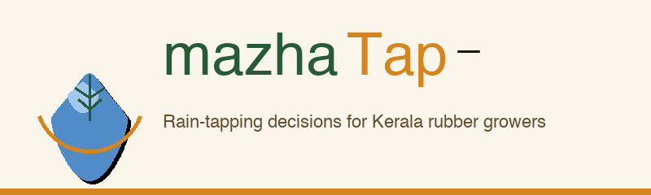
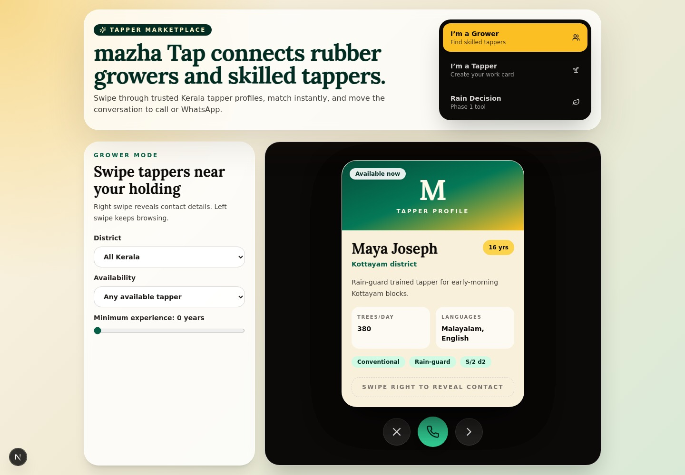
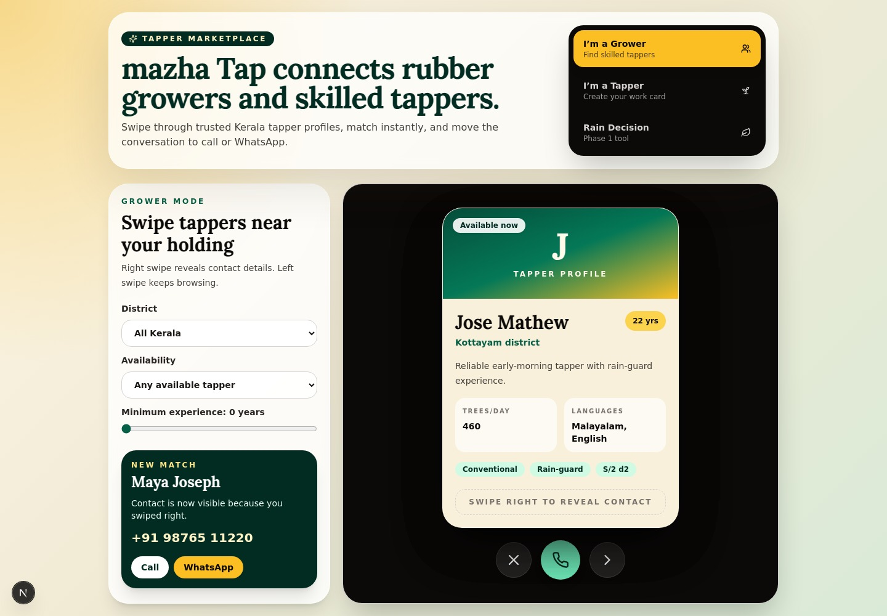
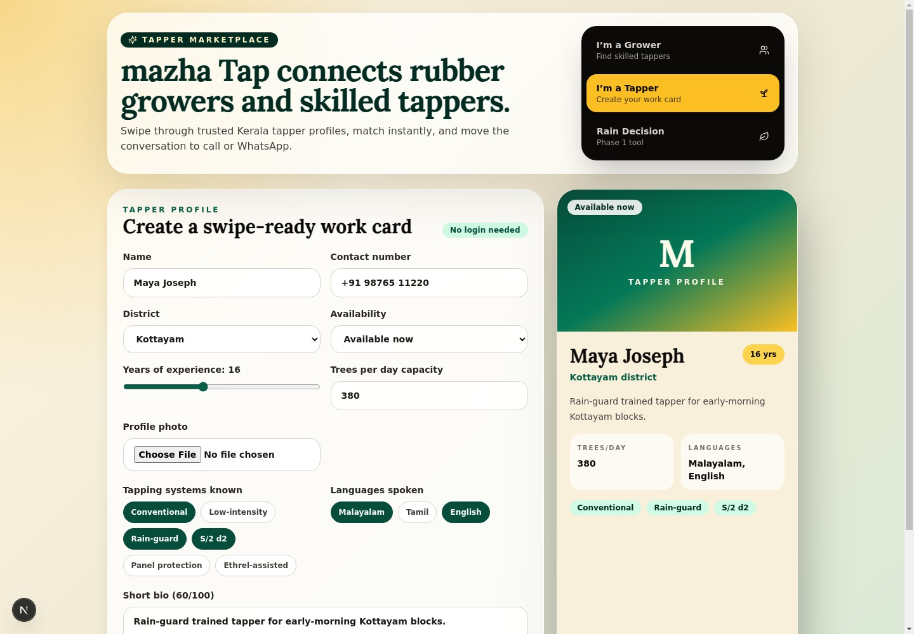
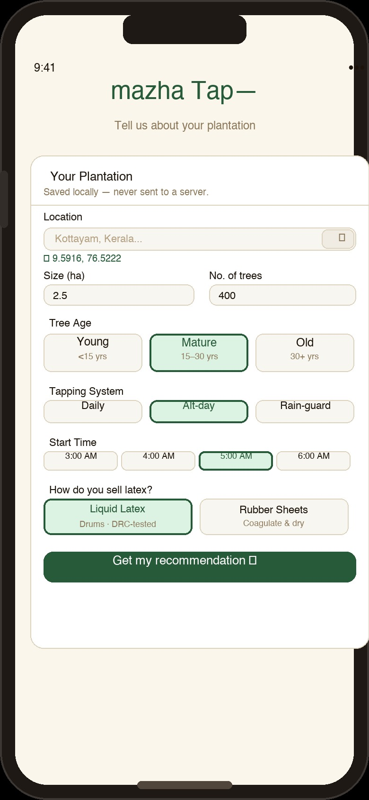
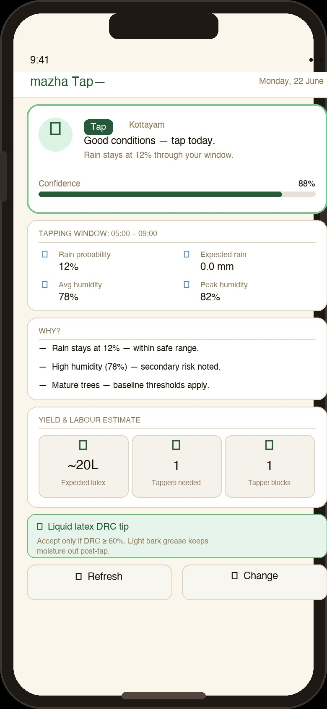
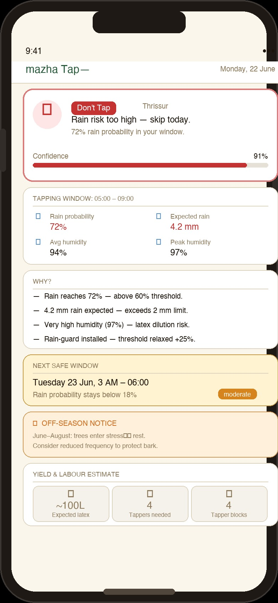
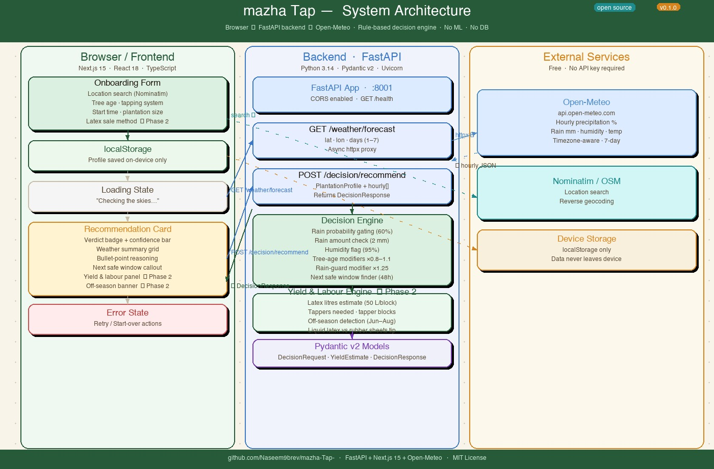

<div align="center">



<br/>


**mazha Tap is a rain-decision and tapper marketplace for Kerala rubber growers.**

Know whether to tap before sunrise, estimate yield and labour, then find skilled tappers nearby.

</div>

---

## What mazha Tap is for

Rubber tapping in Kerala often starts before dawn. A wrong call during monsoon can mean diluted latex, wet bark, lost labour hours, and stressed trees.

**mazha Tap** turns weather, plantation details, and local tapping constraints into one clear decision: **Tap**, **Delay**, or **Don't Tap**. It also helps growers plan expected latex output, estimate the number of tappers needed, and connect directly with skilled tappers through a swipe-based marketplace.

## Product at a glance

| Product area | What it does |
|---|---|
| Grower Marketplace | Browse Kerala tapper work cards by district, availability, and experience. |
| Match Reveal | Right swipe to reveal phone and WhatsApp contact actions. |
| Tapper Mode | Tappers create a public work card with capacity, languages, methods, and availability. |
| Rain Decision | Growers save plantation details and get a plain-language tapping recommendation. |
| Yield & Labour | Estimates litres, tapper blocks, and labour needed for the next tapping day. |
| Rain Risk Guardrails | Blocks or delays tapping when rain probability, rainfall, or humidity crosses safe limits. |

---

## Product screenshots

### 1. Grower Marketplace



Growers filter by district, availability, and experience, then swipe through tapper cards with capacity, methods, language, and local bio details.

### 2. Match Reveal



After a grower matches, mazha Tap reveals the tapper's phone number with direct Call and WhatsApp actions.

### 3. Tapper Work Card Builder



Tappers create and update a work card without login. The builder produces a public share link and private edit link while previewing what growers will see.

### 4. Rain Decision Onboarding



Growers set location, tree age, tapping system, planned start time, tree count, and latex sale method before requesting the first recommendation.

### 5. Tap Verdict



When conditions are safe, mazha Tap returns a high-confidence Tap verdict with the weather window, rain probability, humidity, and reasoning bullets.

### 6. Yield & Labour Planner


The yield card estimates expected litres, tapper blocks, tappers needed, and post-tap handling notes for liquid latex or rubber sheets.

### 7. Don't Tap Rain Risk



When rain risk is too high, the app blocks tapping, explains why, and searches ahead for the next safer window.

---

## Core features

### Rain Decision Engine

- Open-Meteo hourly forecast proxy with no weather API key required.
- Tap, Delay, and Don't Tap recommendations for the grower's exact location.
- Rain probability gates: caution around moderate rain risk and hard block at high risk.
- Rain amount gates for expected rainfall during the tapping window.
- Humidity flag for very high humidity even when rainfall is low.
- Tree-age modifiers for young, mature, and old trees.
- Rain-guard support with relaxed thresholds for protected trees.
- Large-plantation lead-time adjustment for holdings with more than 500 trees.
- Next safe window scan across the next 48 hours.

### Yield & Labour Intelligence

- Expected latex litres per tapping day based on tree count and tapper blocks.
- Number of tappers needed for the holding.
- Tapper block sizing for planning daily work.
- June to August Kerala stress-period detection.
- Liquid latex and rubber sheet handling tips based on sale method.
- Off-season messaging that avoids misleading yield projections.

### Tapper Marketplace

- Grower mode with swipeable tapper cards.
- Tapper mode for creating a no-login work card.
- District, availability, and minimum-experience filters.
- Tapping method tags such as conventional, rain-guard, low-intensity, and S/2 d2.
- Hidden contact details until the grower matches.
- Direct Call and WhatsApp actions after a match.
- Local demo persistence through `localStorage`, with PocketBase support documented for Phase 2 persistence.

---

## How it works

1. A grower saves plantation basics: coordinates, tree age, tree count, tapping system, tapping start hour, and latex sale method.
2. The frontend requests hourly weather from the FastAPI backend.
3. The backend evaluates rainfall, probability, humidity, tree age, rain-guard status, and plantation size.
4. The frontend shows a verdict, confidence score, reasoning, weather summary, next window, and yield/labour estimate.
5. The marketplace lets growers switch from operational planning to finding the tappers needed to execute the work.

---

## Architecture



| Layer | Stack |
|---|---|
| Frontend | Next.js 15, React 18, TypeScript, Tailwind CSS, shadcn-style UI primitives |
| Marketplace UI | react-tinder-card, localStorage demo persistence, optional PocketBase records |
| Maps & Location | Nominatim and OpenStreetMap location search/reverse geocoding |
| Backend | FastAPI, Python 3.14, Pydantic v2, Uvicorn |
| Weather | Open-Meteo forecast API |
| Decision logic | Stateless Python rule engine, no ML dependency |
| Persistence | Browser `localStorage` by default; PocketBase marketplace schema in `docs/pocketbase-marketplace.md` |

---

## Quick start

```bash
# Frontend
npm install --prefix frontend
npm run dev --prefix frontend
```

Open `http://localhost:3000`.

For full Rain Decision API testing, run the backend in another terminal:

```bash
python3 -m pip install -r backend/requirements.txt
python3 -m uvicorn main:app --app-dir backend --host 0.0.0.0 --port 8000
```

The marketplace works locally with seed data and browser `localStorage` when `NEXT_PUBLIC_POCKETBASE_URL` is unset.

---

## API

```http
GET  /health
GET  /weather/forecast?lat=9.59&lon=76.52&days=2
POST /decision/recommend
```

Example `POST /decision/recommend` response:

```json
{
  "recommendation": "tap",
  "confidence": 88,
  "headline": "Good conditions — tap today.",
  "reasoning": ["Rain stays below the hard limit during the tapping window."],
  "next_window": null,
  "weather_summary": {
    "tapping_window": "05:00–09:00",
    "max_rain_probability_pct": 12,
    "expected_rain_mm": 0.2,
    "avg_humidity_pct": 82,
    "max_humidity_pct": 88
  },
  "yield_estimate": {
    "estimated_litres": 20,
    "tappers_needed": 1,
    "num_blocks": 1,
    "off_season": false,
    "note": "Expected liquid latex for this tapping day."
  }
}
```

---

## Roadmap

- [x] FastAPI backend and Open-Meteo weather proxy
- [x] Rule-based rain decision engine
- [x] Next.js frontend for onboarding and recommendations
- [x] Yield and labour estimator
- [x] Off-season detection
- [x] Latex sale method onboarding and tailored tips
- [x] Tapper Marketplace with role switcher and swipeable profiles
- [ ] PocketBase-backed marketplace persistence
- [ ] Leaflet interactive map pin for precise plantation location
- [ ] Malayalam/English language toggle
- [ ] Offline PWA cache for the latest forecast and recommendation

---

<div align="center">
  <sub>Built for the rubber growers of Kerala · MIT © 2026</sub>
</div>
