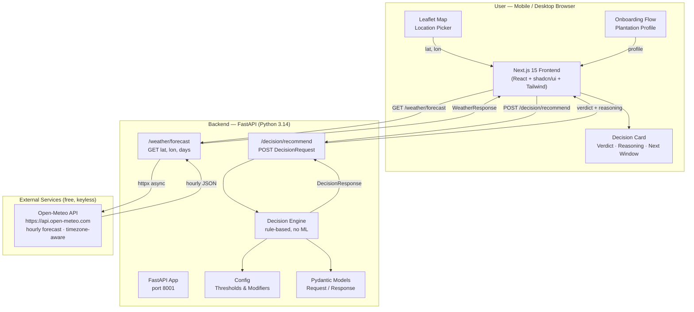

# mazha Tap — മഴ Tap

> **Rain-tapping decision intelligence for Kerala rubber growers.**  
> Know whether to tap before you leave the house — no app subscription, no hidden fees, no API key required.

---

## What is mazha Tap?

Rubber latex yield is acutely sensitive to rain. A single wet tapping session can dilute latex, damage bark, and cost a grower hours of wasted effort. In Kerala's unpredictable monsoon climate, deciding *when* to tap is one of the most consequential judgements a rubber farmer makes each morning.

**mazha Tap** (malayalam: *mazha* = rain) is a hyper-local, rule-based decision agent that ingests real-time hourly weather forecasts and your plantation's profile — tree age, tapping system, number of trees, preferred start time — and returns a clear, plain-language verdict:

| Verdict | Meaning |
|---|---|
| ✅ **Tap** | Conditions look safe within your tapping window |
| ⚠️ **Delay** | Rain risk moderate — wait a few hours; we'll suggest the next safe slot |
| ❌ **Don't Tap** | Rain probability or amount exceeds safe thresholds |

The system explains its reasoning in bullet points so growers understand *why*, not just *what*.

---

## Who is it for?

- **Smallholder rubber growers** in Kerala with 50–2 000 trees who tap early morning (typically 5 AM – 9 AM)
- **Large plantation managers** who need to coordinate labour across hundreds of trees and start earlier to beat rain
- **Agricultural extension workers** who want a lightweight, offline-capable decision aid to share with farming communities
- **Developers & researchers** exploring transparent, explainable AI for smallholder agriculture

---

## Architecture



### Architecture at a glance

| Layer | Technology | Role |
|---|---|---|
| **Frontend** | Next.js 15, React 18, Tailwind CSS, shadcn/ui | UI, onboarding, map, results display |
| **Map** | Leaflet / react-leaflet | Location pin for precise lat/lon |
| **Backend** | FastAPI, Uvicorn, Python 3.14 | REST API, weather proxy, decision routing |
| **Weather** | Open-Meteo (free, no key) | Hourly precipitation, humidity, temperature |
| **Decision Engine** | Pure Python, rule-based | Tap / delay / don't-tap verdict with reasoning |
| **Validation** | Pydantic v2 | Typed request/response contracts |

---

## Feature List

### Decision Engine
- **Three-level verdict**: `tap` · `delay` · `dont_tap` with a 0–100 confidence score
- **Rain probability gating** — blocks tapping if any hour in the window exceeds a configurable threshold (default 60%)
- **Rain amount gating** — separate check on expected mm of rainfall (block at 2 mm, caution at 0.5 mm)
- **Humidity awareness** — flags very high humidity (≥ 95%) as a latex-dilution risk even without rain
- **Tree age modifiers** — young trees tighten thresholds by 20%; old trees relax them by 10%
- **Rain-guard system support** — growers with physical rain-guard installations get a 25% threshold relaxation
- **Large plantation lead-time** — plantations > 500 trees get an earlier recommended start to complete tapping before rain arrives (configurable, default 45 min lead)
- **Next safe window finder** — when today is a no-go, scans the next 48 h for the first 3-consecutive-hour block below caution thresholds
- **Tapping season awareness** — warns growers checking outside the June–February season; off-season notice is shown alongside the weather verdict
- **Yield & labour estimator** — calculates expected latex yield (~50 L per 300-tree block), number of tapper blocks, tappers required, and plantation size in acres from the tree count
- **Latex sale method context** — growers who sell liquid latex get a DRC-testing reminder; rubber-sheet producers are reminded that wet weather delays sun/smoke drying
- **Human-readable reasoning** — every verdict comes with bullet-point explanations in plain language

### Domain constants (from practitioner knowledge)

| Constant | Value | Source |
|---|---|---|
| Tapping season | June – February | South-west monsoon onset; trees rest March–May |
| Standard planting density | 200 trees / acre | Kerala norm |
| Tapper block size | 300 trees / day | One tapper per block on alternate days |
| Typical daily yield | ~50 litres / block | On a good day during peak season |
| Min. farm for 1 full-time tapper | 600 trees (3 acres, 2 blocks) | Economic threshold |

### Backend API
- `GET /health` — liveness check
- `GET /weather/forecast?lat=&lon=&days=` — proxies Open-Meteo, normalises response, supports 1–7 day windows
- `POST /decision/recommend` — accepts plantation profile + hourly forecast, returns structured `DecisionResponse`
- Full CORS support for local frontend development
- Async httpx for non-blocking weather fetches

### Frontend
- **Onboarding flow** — collects tree age, tapping system (default: alternate-day), number of trees, preferred start time, and latex sale method
- **Decision display card** — verdict badge, confidence bar, reasoning bullets, next safe window suggestion
- **Off-season banner** — shown automatically when the user checks outside June–February
- **Yield & labour card** — estimated litres of latex, tapper blocks, tappers needed; plain-language post-harvest advice based on sale method
- **shadcn/ui component library** — Button, Card, Badge, Separator, Progress
- **next-themes** — dark/light mode ready
- Kerala-inspired warm earthy colour palette (ambers, deep greens, cream tones)

---

## Use Case Examples

### Example 1 — Smallholder in Kottayam, early monsoon
> Rajesh has 200 mature rubber trees and taps from 5:30 AM. He opens mazha Tap the evening before, pins his plot near Kottayam, and gets:  
> **✅ Tap — 82% confidence**  
> *"Rain probability stays at 18% during your tapping window — within safe range. High ambient humidity (87% avg) — secondary risk noted."*  
> He taps as usual and finishes before the 9 AM showers.

### Example 2 — Large plantation manager, peak monsoon
> Meena manages a 700-tree estate in Thrissur. mazha Tap detects a 70% rain probability at 6 AM:  
> **❌ Don't Tap — 91% confidence**  
> *"Rain probability reaches 70% during your tapping window (peaking around 06:00) — above the safe threshold of 60%."*  
> *"Next safe window: Wednesday 18 Jun, 3 AM to 06:00 — rain probability stays below 22%."*  
> She reschedules her labour crew and avoids bark damage.

### Example 3 — Young-tree grower with rain-guard
> Arun planted 150 young trees last season and has installed rain-guards. He checks mazha Tap at 4:45 AM:  
> **⚠️ Delay — 63% confidence**  
> *"Rain probability is 38% during your window — moderate risk."*  
> *"Rain-guard system installed — risk thresholds relaxed by 25%."*  
> *"Young trees are more sensitive to bark moisture — thresholds tightened accordingly."*  
> He delays by 2 hours and taps safely after a light drizzle passes.

### Example 4 — Extension worker field demonstration
> A Kerala Agricultural University researcher uses the `POST /decision/recommend` API directly to batch-evaluate 50 plantation profiles for a study on climate-adaptive tapping schedules during the south-west monsoon.

---

## Project Structure

```
mazha-Tap-/
├── backend/
│   ├── main.py                  # FastAPI app entry point
│   ├── requirements.txt         # Python dependencies
│   ├── .env.example             # Environment variable template
│   ├── routers/
│   │   ├── weather.py           # /weather/forecast endpoint
│   │   └── decision.py          # /decision/recommend endpoint
│   └── engine/
│       ├── config.py            # All thresholds & modifiers (no magic numbers)
│       ├── models.py            # Pydantic request/response models
│       └── decision_engine.py   # Core tap/no-tap rule logic
└── frontend/
    ├── app/
    │   ├── layout.tsx           # Root layout, fonts, metadata
    │   ├── page.tsx             # Main page
    │   └── globals.css          # Global styles, colour palette
    ├── components/
    │   └── ui/                  # shadcn/ui components (Button, Card, Badge…)
    ├── lib/utils.ts             # Tailwind class utilities
    ├── next.config.ts           # Next.js config
    └── package.json             # Node dependencies
```

---

## Getting Started

### Backend

```bash
cd backend
python -m venv .venv && source .venv/bin/activate
pip install -r requirements.txt
uvicorn main:app --reload --port 8001
# Health check: http://localhost:8001/health
```

### Frontend

```bash
cd frontend
npm install
npm run dev
# Opens at http://localhost:3000
```

### Quick API test

```bash
# Weather forecast for Kottayam
curl "http://localhost:8001/weather/forecast?lat=9.59&lon=76.52&days=2"

# Decision recommendation
curl -X POST http://localhost:8001/decision/recommend \
  -H "Content-Type: application/json" \
  -d '{
    "plantation": {
      "latitude": 9.59,
      "longitude": 76.52,
      "tree_age": "mature",
      "tapping_system": "daily",
      "num_trees": 200,
      "tap_start_hour": 5
    },
    "hourly_forecast": [
      {
        "time": "2026-06-20T05:00",
        "precipitation_probability": 15,
        "precipitation": 0.0,
        "relative_humidity_2m": 82,
        "temperature_2m": 24.5,
        "rain": 0.0,
        "weathercode": 1
      }
    ]
  }'
```

---

## Decision Thresholds (configurable in `backend/engine/config.py`)

| Parameter | Default | Description |
|---|---|---|
| `RAIN_PROB_BLOCK` | 60% | Hard block if any hour exceeds this |
| `RAIN_PROB_CAUTION` | 35% | Caution warning threshold |
| `RAIN_PROB_CLEAR` | 20% | Below this = negligible risk |
| `RAIN_AMOUNT_BLOCK` | 2.0 mm | Hard block on expected rainfall |
| `RAIN_AMOUNT_CAUTION` | 0.5 mm | Caution threshold |
| `HUMIDITY_HIGH` | 95% | Strong caution even without rain |
| `HUMIDITY_CAUTION` | 85% | Secondary risk flag |
| `TREE_AGE_MODIFIERS` | young ×0.80, mature ×1.00, old ×1.10 | Multiplied on probability thresholds |
| `RAIN_GUARD_MODIFIER` | ×1.25 | Threshold relaxation for rain-guard systems |
| `LARGE_PLANTATION_LEAD_MINUTES` | 45 min | Earlier start for > 500 trees |

---

## Tech Stack

| | |
|---|---|
| **Language (backend)** | Python 3.14 |
| **Framework (backend)** | FastAPI 0.115+ · Uvicorn · Pydantic v2 |
| **Weather data** | Open-Meteo (free, no API key) |
| **Language (frontend)** | TypeScript 5 |
| **Framework (frontend)** | Next.js 15.3 · React 18 |
| **UI Components** | shadcn/ui · Radix UI primitives |
| **Styling** | Tailwind CSS 3.4 · tailwindcss-animate |
| **Maps** | Leaflet 1.9 · react-leaflet 4.2 |
| **HTTP client** | httpx (async) |

---

## Roadmap

- [ ] Complete frontend onboarding flow and decision display UI
- [ ] Leaflet map integration for location pin selection
- [ ] Kerala-district boundary overlay on map
- [ ] Push notifications for next-safe-window alerts
- [ ] Offline PWA mode with cached last forecast
- [ ] Multi-language support (Malayalam / English)
- [ ] Historical tapping log with weather correlation
- [ ] Deployment guide (Vercel + Fly.io / Railway)

---

## License

MIT © 2026 — see [LICENSE](LICENSE)

---

*mazha Tap is built for the rubber growers of Kerala.*  
*No cloud lock-in. No subscription. No guessing.*
