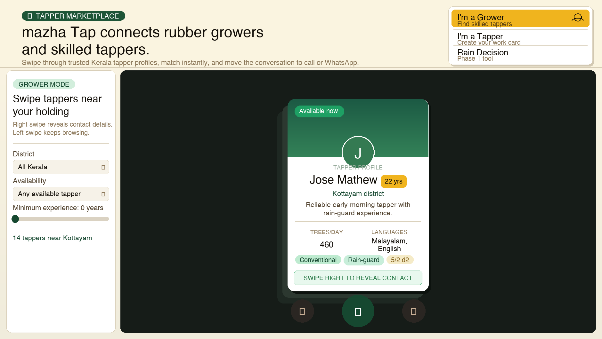
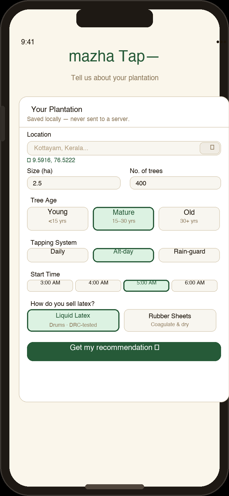
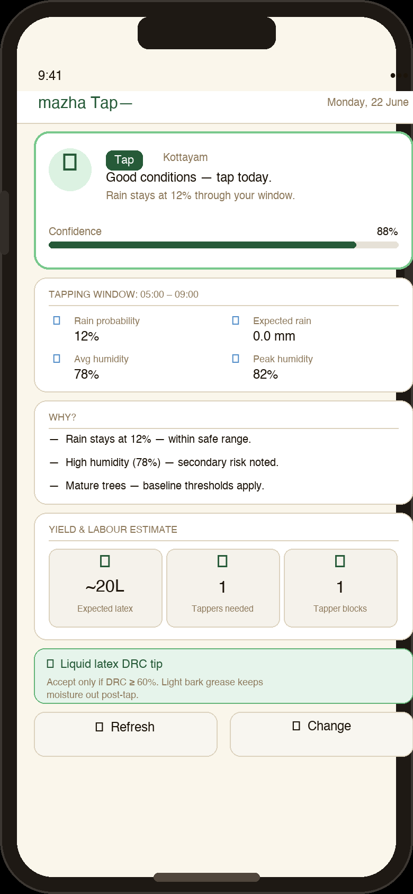
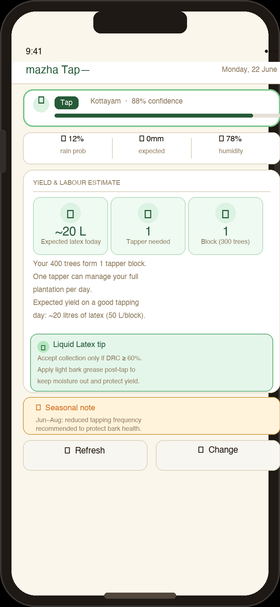
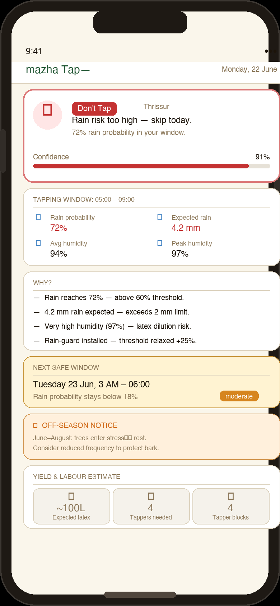

<div align="center">


<br/>


**Know whether to tap your rubber trees before you leave the house.**  
No subscription. No API key. No guessing.

</div>

---

## What it does

Kerala rubber growers tap early morning — usually 3–6 AM. One wrong call in the monsoon means diluted latex, wet bark, and wasted hours.

**mazha Tap** reads the hourly forecast for your exact location and returns a single, plain-language verdict:

| | Verdict | When |
|---|---|---|
| ✅ | **Tap** | Rain risk is low within your window |
| ⚠️ | **Delay** | Moderate risk — here's your next safe slot |
| ❌ | **Don't Tap** | Rain probability or amount is too high |

Every verdict includes bullet-point reasoning, a weather summary, confidence score — and now a **yield & labour estimate** so you know how much latex to expect and how many tappers to deploy.

Beyond the decision tool, mazha Tap is growing into a **Tapper Marketplace** — connecting growers with skilled Kerala tappers they can browse, filter, and contact with a swipe.

---

## Tapper Marketplace ✨ Phase 3



Growers can swipe through verified tapper profiles filtered by district, availability, and experience. Right swipe reveals the tapper's contact — no middleman, no platform fee. Tappers create a work card showing their daily capacity, languages, and tapping methods (conventional, rain-guard, 5/2 d2). The marketplace sits alongside the rain decision tool under the same app — switch between Grower Mode, Tapper Mode, and Rain Decision from the role selector.

---

## Screenshots — Rain Decision Tool

<div align="center">
<table>
<tr>
<td align="center" width="25%">
<br/>
<sub><b>Onboarding</b><br/>Location · Tree age<br/>Tapping system · Sale method</sub>
</td>
<td align="center" width="25%">
<br/>
<sub><b>Tap — clear conditions</b><br/>Confidence bar · Weather grid<br/>Reasoning bullets</sub>
</td>
<td align="center" width="25%">
<br/>
<sub><b>Yield & Labour card ✨</b><br/>Expected litres · Tappers needed<br/>Tapper blocks · Latex tip · Off-season note</sub>
</td>
<td align="center" width="25%">
<br/>
<sub><b>Don't Tap — rain risk</b><br/>Next safe window<br/>Off-season banner</sub>
</td>
</tr>
</table>
</div>

---

## Architecture


---

## Built with

| Layer | Stack |
|---|---|
| Frontend | Next.js 15 · React 18 · TypeScript · Tailwind CSS · shadcn/ui |
| Maps & Location | Nominatim / OpenStreetMap (location search + reverse geocoding) |
| App runtime | Vercel-hosted Next.js app |
| Marketplace data | Supabase Postgres · Auth · Storage |
| Weather | [Open-Meteo](https://open-meteo.com) — free, no API key |
| Decision logic | Rule engine surfaced through the Next.js app — no separate FastAPI deploy required |
| Persistence | Supabase-backed marketplace records; plantation preferences remain browser-local |

---

## Features

### Phase 1 — Decision Engine
- Rain probability gating (hard block at 60%, caution at 35%)
- Rain amount threshold (block at 2 mm, caution at 0.5 mm)
- Humidity flag — very high humidity (≥ 95%) triggers caution even without rain
- Tree age modifiers — young trees tighten thresholds, old trees relax them
- Rain-guard support — 25% threshold relaxation for installed rain-guard systems
- Large plantation lead-time — > 500 trees gets an earlier recommended start
- Next safe window — scans 48 h ahead for the first clean 3-hour slot

### Phase 2 — Yield & Labour Intelligence ✨
- **Latex yield estimate** — calculates expected litres per tapping day based on tree count (50 L/tapper block)
- **Labour planning** — tells you how many tappers you need and how many blocks your plantation forms
- **Off-season detection** — flags June–August Kerala stress period; warns against over-tapping
- **Latex sale method** — onboarding captures whether you sell liquid latex or rubber sheets; tailored post-tap tips (DRC % for liquid, coagulation timing for sheets)
- **Seasonal awareness** — yield engine skips estimates during declared off-season to avoid misleading projections

### Phase 3 — Tapper Marketplace ✨
- **Swipeable tapper profiles** — browse Kerala tappers filtered by district, availability, and minimum experience
- **Tapper work cards** — daily tree capacity, languages, tapping methods (conventional, rain-guard, 5/2 d2), availability status
- **Right swipe to reveal contact** — no intermediary; direct call or WhatsApp
- **Dual role** — same app switches between Grower Mode, Tapper Mode, and Rain Decision tool
- **Stacked card UI** — Tinder-style card stack with ✕ / contact / → swipe actions

### Frontend
- Onboarding form — location search, tree age, tapping system, preferred start time, latex sale method
- Recommendation card — verdict badge, confidence bar, weather grid, reasoning bullets, next safe window, yield & labour panel, off-season banner
- Saves your plantation profile locally — skips onboarding on return visits
- Dark mode · Kerala earthy colour palette (deep greens, amber, warm cream)

---

## Quick start

```bash
cd frontend && npm install
cp .env.local.example .env.local   # set Supabase public URL + anon key
npm run dev
```

Open [http://localhost:3000](http://localhost:3000)

---

## Deployment

Deploy the app as a Vercel Next.js project from the repo root; `vercel.json` runs the frontend install/build scripts. Add the Supabase public URL and anon key to Vercel Preview first, validate the generated preview URL, and only promote to Production after review. See [`DEPLOY.md`](DEPLOY.md) and [`docs/supabase-marketplace.md`](docs/supabase-marketplace.md).

---

## Roadmap

- [x] Rule-based decision engine
- [x] Next.js 15 frontend — onboarding, recommendation card, dark mode
- [x] localStorage persistence, no login required
- [x] **Yield & labour estimator** ✨
- [x] **Off-season detection** ✨
- [x] **Latex sale method onboarding + tailored tips** ✨
- [x] **Tapper Marketplace — swipeable profiles, role switcher** ✨
- [x] Vercel-only deployment path with Supabase-backed marketplace persistence
- [ ] Leaflet interactive map for precise location pin
- [ ] Offline PWA with cached last forecast
- [ ] Malayalam / English language toggle
- [ ] Production launch after Vercel preview review

---

<div align="center">
  <sub>Built for the rubber growers of Kerala · MIT © 2026</sub>
</div>
